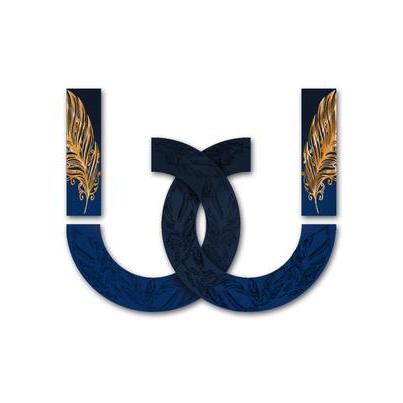
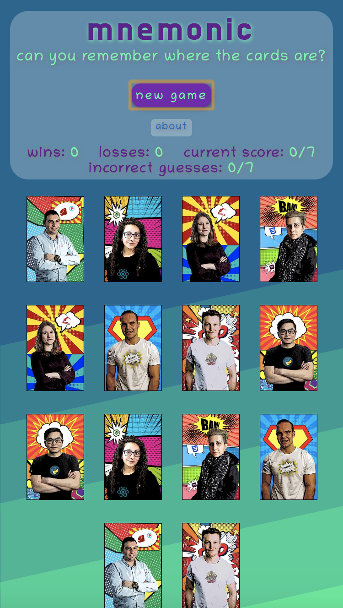
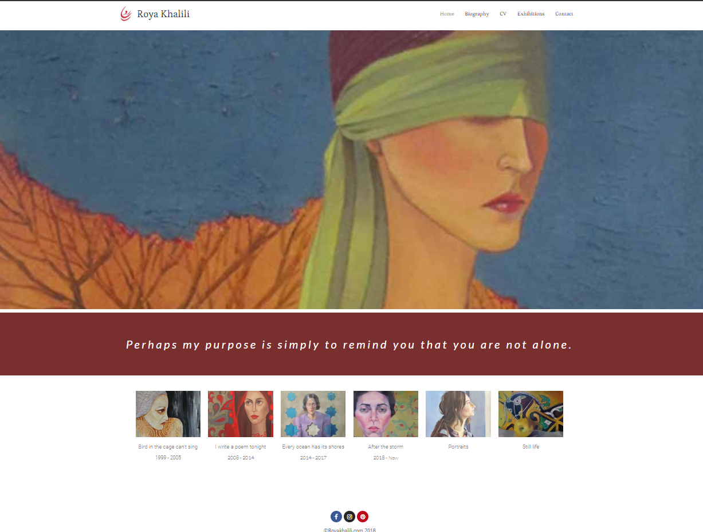
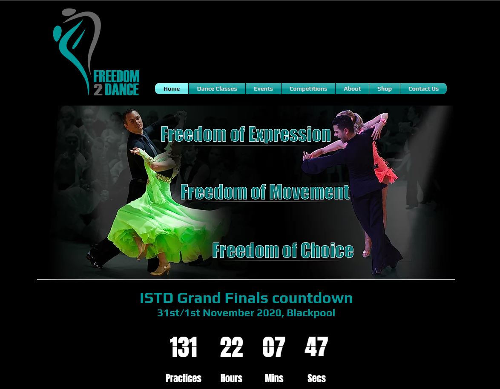
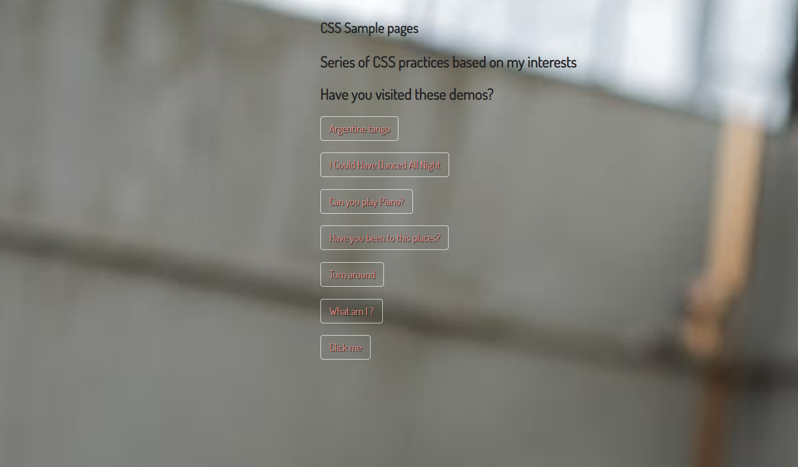
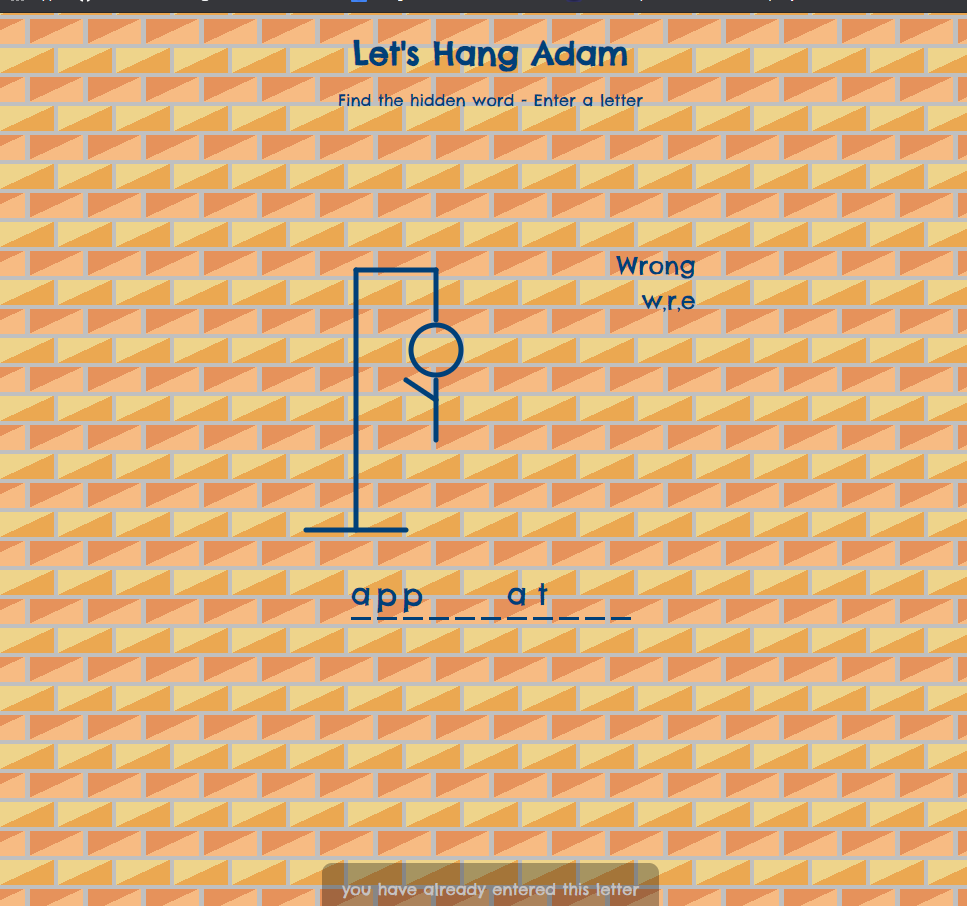

<a href="https://bdesignstudio.co.uk/">

<h1 align="center">Barri Faryad</h1>

  [About me](#about_me) | [Projects](#projects) | [Education](#education) | [Experience](#experience) | [Skills](#skills) | [Interests](#interests) | [website](https://bdesignstudio.co.uk/) 

  

## <a name="about_me">About me</a>

I am a full stack software developer, passionate for Front-end development with a background in graphic design. 

I have experience designing websites with Adobe Dreamweaver and CMS platforms such as WordPress and Wix. After mastering the basics, I then started learning to code to overcome the restrictions of the platforms.

As soon as I started learning to code I found myself excited and engaged with it. So after 7 months of teaching myself to code, I decided to join Makers Academy to improve my knowledge and challenge myself. Now creating apps, debugging, finding solutions and stylings are my new tools.

## <a name="skills">Tech Skills</a>
- Javascript - React - Node.js
- Ruby - Rails
- HTML - CSS - Bootstrap 
- RSpec
- Jasmine - Jest - Enzyme
- Sinatra - Capybara
- PostgreSQL - MySQL
- Travis CI - Code Climate - Heroku
- Netlify - cPanel - Domain - hosting management 

#### Web/UI design Skill

- Adobe XD - Figma - Invision
- Adobe Photoshop
- Adobe Illustrator
- Adobe Indesign

## <a name="projects">Dev Projects</a>

|
Project | Description | Links  | Tech | Status  | 
|---     |---   |---          |---   |---    |
| 
[mnemonic](https://mnemonic-game.herokuapp.com/)
 | My final group project at Makers! A game app for training your short term memory | To project:  http://mnemonic-game.herokuapp.com/   To code:  https://github.com/BarriF13/mnemonic| Javascript, React, CSS, HTML, Adobe photoshop | Finalized |
|
[Artist portfolio](https://royakhalili.com/)
  | I have designed and built an online portfolio for one of my clients to showcase her arts. I am managing the domain, hosting and maintenance of the site.  |To project:  https://royakhalili.com/ | Wordpress, CSS, HTML, cPanel, Adobe photoshop | Maintenance|
|
 [Freedom2dance](https://www.freedom-2-dance.co.uk/)
  | I have designed and built this site for Freedom2Dance as part of their digital products. I have also update their brand and designed their print and digital materials.|To project:  https://www.freedom-2-dance.co.uk/| WIX, CSS, HTML, Adobe photoshop | Maintenance|
|
 [CSS Collection](https://css-styles-demo.netlify.app/)
  | CSS collection is a side project that I do for mastering CSS. Also I use this repo as one of my CSS resources. | To project: https://css-styles-demo.netlify.app/   To code:  https://github.com/BarriF13/CSS-animation | CSS, HTML, Netlify, Adobe Photoshop | Ongoing project|
|
 [Let's hang Adam](https://lets-hang-adam.netlify.app/)
  | Let's hang Adam is a guessing game known as hangman. Player  tries to guess the word by suggesting letters within a certain number of guesses.| To project: https://lets-hang-adam.netlify.app/    To code: https://github.com/BarriF13/Guess_game | CSS, HTML, Netlify | Finalized |

#
## <a name="education">Education</a>

#### Makers Academy (December 2019 to April 2020)

Makers Academy is an intensive 16-week full-stack web development bootcamp in London, focused on teaching the fundamentals of software engineering:

- OOP, TDD, MVC, DDD
- Agile
- Ruby, Rails, JavaScript
- RSpec, Jasmine, Jest, Enzyme
- Git, GitHub

#### School of UX - 2019

An insightful, hands-on & intensive course on User Experience design:
  

- UX design: mapping user journeys, creating information architecture, sitemaps, etc.

- UI design: accessibility, typography, responsive layout, etc.

- Prototyping & wireframing: structuring content, creating an interactive layout, testing, etc.

  

#### Bachelor's degree in Graphic Design 1998-2002

- Branding

- Logo design

- Photography

- Color compositions and layouts

- Packaging

- Drawing

  

## <a name="experience">Experience</a>

  

### **B design studio** (2004 - present)

#### *Freelance graphic/web designer*
Since University I have worked as a freelance designer. I've been selected to do projects for different types of clients such as freelancers and businesses of various sizes.
For each, I have helped improve their identity and brand design. I have also always highlighted to them the importance of digital products and their presence in the cyber world.
As their designer and digital adviser, I had to make sure their digital products are up and running and are in line with the latest trends in the industry, for example on their website:
- Being responsive, fast loading, optimized for search engines, etc.

- Tested for the best possible user experience.

- Designed with high quality of user interface standards.

- All product - print or digital- follow the same branding prototype.

Also as a freelancer, I was always challenged to:
- Work with limited budgets for individual or freelance clients and still deliver market standard quality products.
- Co-operate with different teams such as photographers, and making sure we are following the same goals.
- Finding smart solutions for any technical or financial obstacle.
  

### **Lorca Digital Photography Studio** (2000 - 2003)

#### *web/graphic designer  ( in house)*

Working for one of the biggest photography studios as a junior designer helped me:
- Learn how to work within a big team towards the same goal.
- Manage my responsibilities, work under pressure and meet deadlines.
- Achieve set design skills and help photographers to produce better visual products.
- Talking to clients when the senior designers weren't available.
- Branding and producing print materials.
- Producing high-quality digital photos.
- Helping other designers to convert their print products to digital format.
### **HV Substations Development Co.** (2000 - 2003)

#### *In house part-time Web designer*

In my first role as a web designer, working side by side with a web developer, I learned about HTML, CSS, Javascript. Our approach to web design was very simple compared to now. I showed sensitivity when designing on UX/UI bases by addressing these points:
- How users feel when they approach the site.
- What messages we deliver to them.
- How easy it is for them to access the information they are looking for.
- Issues around accessibility and many more.
  
  

## <a name="interests">Interests</a>

Art, ballroom dancing, going to the gym, computer games, sewing, hiking, DIY

<link rel="stylesheet" href="images/style.css">